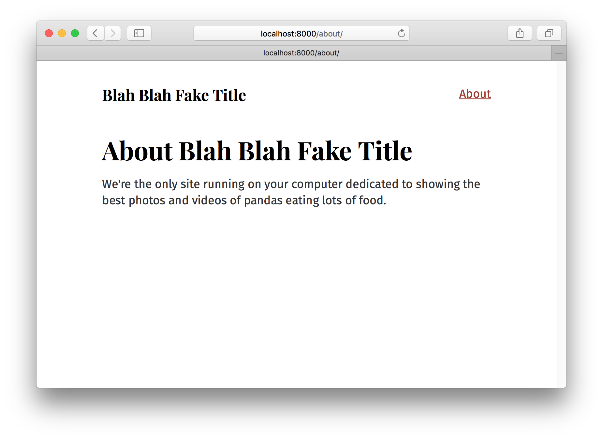
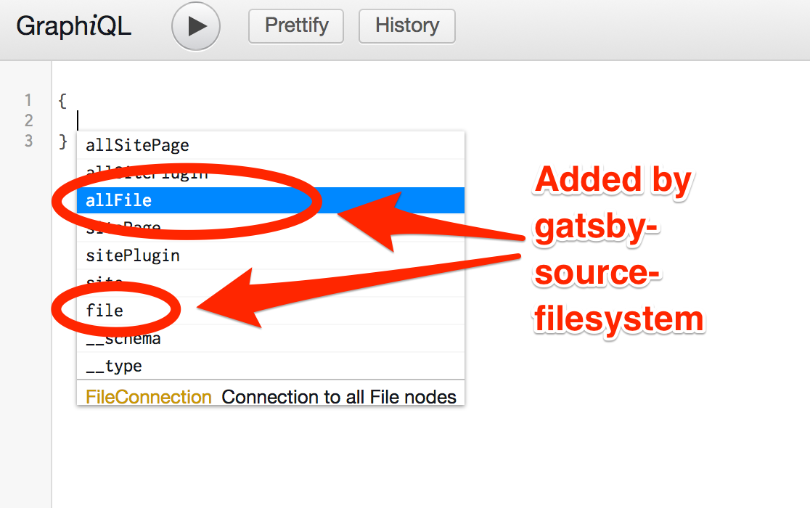
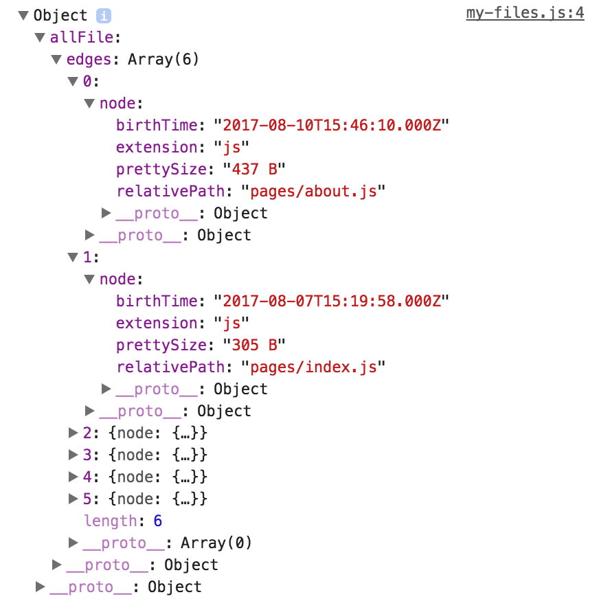
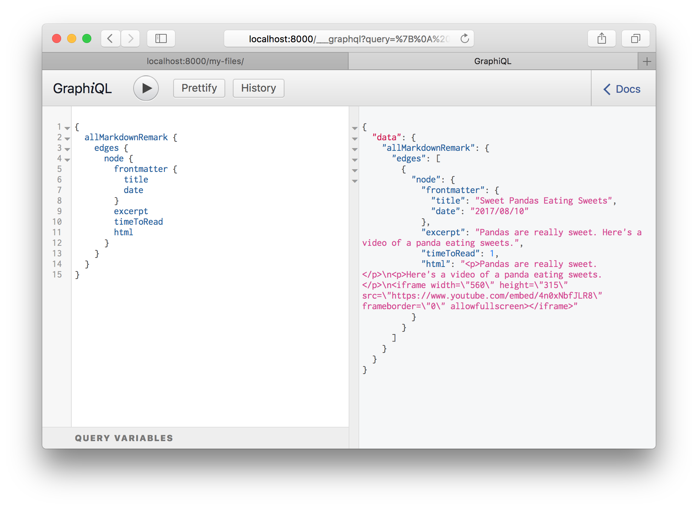

Welcome to Part Four of the tutorial! Halfway through! Hope things are starting to feel pretty comfortable 😀

But don't feel too comfortable 😉. In this tutorial, we're going to travel into some new territory which will requires some brain stretching to fully understand. But don't worry, it'll be worth it. In the next two parts of the tutorial, we'll be diving into the Gatsby data layer!

## Recap of first half of the tutorial

So far we've been learning how to use React.js components to build websites. That we can easily create our own components to act as custom building blocks for building sites.

We've also explored styling components using CSS-in-JS which lets us encapsulate CSS within our components.

## Data

A website has four parts, HTML, CSS, JS, and data. The first half of the tutorial focused on the first three. Let's learn now how to use data in Gatsby sites.

What is data?

A very computer science-y answer would be—data is things like `"strings"`, integers (`42`), objects (`{ pizza: true }`), etc.

For the purpose of working in Gatsby however, a more useful answer is "everything that's not in a React component".

So far we've been writing text and adding images *directly* in components. Which is an *excellent* way to build many websites. But often you want to store data *outside* components and then bring the data *into* the component as needed.

For example, if you're building a site with Wordpress and Gatsby, the *data* for the site (pages and posts) are in Wordpress and you *pull* that data as needed into your components.

Data can also live in markdown, csv, and other files, databases, and APIs of all sort.

**Gatsby's data layer lets us pull data from these (and any other source) directly into our components**—in the shape and form we want our data.

## How Gatsby's data layer uses GraphQL to pull data into components 

If you're familiar with the React world, there's many options for how to load data into components. One of the most popular and robust of these is a technology called [GraphQL](http://graphql.org/).

GraphQL was invented at Facebook to help product engineers pull data into components.

GraphQL is a query language (the *QL* part of its name). If you're familiar with SQL, it works in a very similar way. You describe in code, using a special syntax, the data you want and then that data is given to you.

Gatsby uses GraphQL to let components declare, using GraphQL queries, the data it needs and then gives this data to components.

## Our first GraphQL query

Let's create another new site for this part of the tutorial like in the previous parts. We're going to build a simple markdown blog called "Pandas Eating Lots". It's dedicated to showing off the best pictures & videos of Pandas eating lots of food. Along the way we'll be dipping our toes into GraphQL and Gatsby's markdown support.

```shell
gatsby new tutorial-part-four https://github.com/gatsbyjs/gatsby-starter-hello-world
```

Then install some other needed dependencies. We'll use the Typography theme Kirkham + we'll try out another CSS-in-JS library [Glamorous](https://glamorous.rocks/).

```shell
npm install --save gatsby-plugin-typography gatsby-plugin-glamor glamorous typography-theme-kirkham
```

Let's setup a site similar to what we ended with last time with a layout component and two page components.

`src/pages/index.js`

```jsx
import React from "react"

export default () =>
  <div>
    <h1>Amazing Pandas Eating Things</h1>
    <div>
      
    </div>
  </div>
```

`src/pages/about.js`

```jsx
import React from "react"

export default () =>
  <div>
    <h1>About Pandas Eating Lots</h1>
    <p>
      We're the only site running on your computer dedicated to showing the best
      photos and videos of pandas eating lots of food.
    </p>
  </div>
```

`src/layouts/index.js`

```jsx
import React from "react"
import g from "glamorous"
import { css } from "glamor"
import Link from "gatsby-link"

import { rhythm } from "../utils/typography"

const linkStyle = css({ float: `right` })

export default ({ children }) =>
  <g.Div
    margin={`0 auto`}
    maxWidth={700}
    padding={rhythm(2)}
    paddingTop={rhythm(1.5)}
  >
    <Link to={`/`}>
      <g.H3
        marginBottom={rhythm(2)}
        display={`inline-block`}
        fontStyle={`normal`}
      >
        Pandas Eating Lots
      </g.H3>
    </Link>
    <Link className={linkStyle} to={`/about/`}>
      About
    </Link>
    {children()}
  </g.Div>
```

`src/utils/typography.js`

```javascript
import Typography from "typography"
import kirkhamTheme from "typography-theme-kirkham"

const typography = new Typography(kirkhamTheme)

module.exports = typography
```

`gatsby-config.js`

```javascript
module.exports = {
  plugins: [
    `gatsby-plugin-glamor`,
    {
      resolve: `gatsby-plugin-typography`,
      options: {
        pathToConfigModule: `src/utils/typography`,
      },
    },
  ],
}
```

Add the above files and then run `gatsby develop` like normal and you should see the following:


We have another simple site with a layout and two pages.

Now let's start querying 😋

When building sites, it's common to want to reuse common bits of data across the site. Like the *site title* for example. You'll notice looking at the About page that we have the site title in both the layout component (for the header) as well as the title of the About page. But what if we want to change the site title at some point in the future? We'd have to search across the site for everywhere we put the title. Which is both cumbersome but it's also easy to miss spots, especially as sites get larger and more complex. Much better to store the title in one place and then *pull* that title into components whenever we need it.

To solve this Gatsby supports a simple pattern for adding site "metadata" like the title.

In your `gatsby-config.js` you can add data which you can then easily query in your components. So let's add our site title to `gatsby-config.js` and then query it from our layout and about page!

Edit your `gatsby-config.js`:

```javascript{2-4}
module.exports = {
  siteMetadata: {
    title: `Blah Blah Fake Title`,
  },
  plugins: [
    `gatsby-plugin-glamor`,
    {
      resolve: `gatsby-plugin-typography`,
      options: {
        pathToConfigModule: `src/utils/typography`,
      },
    },
  ],
}
```

Then edit the two components:

`src/pages/about.js`

```jsx{3,6,11-14}
import React from "react"

export default ({ data }) =>
  <div>
    <h1>
      About {data.site.siteMetadata.title}
    </h1>
    <p>
      We're the only site running on your computer dedicated to showing the best
      photos and videos of pandas eating lots of food.
    </p>
  </div>

export const query = graphql`
  query AboutQuery {
    site {
      siteMetadata {
        title
      }
    }
  }
`
```

`src/layouts/index.js`

```jsx{10,19,28-33}
import React from "react"
import g from "glamorous"
import { css } from "glamor"
import Link from "gatsby-link"

import { rhythm } from "../utils/typography"

const linkStyle = css({ float: `right` })

export default ({ children, data }) =>
  <g.Div
    margin={`0 auto`}
    maxWidth={700}
    padding={rhythm(2)}
    paddingTop={rhythm(1.5)}
  >
    <Link to={`/`}>
      <g.H3 marginBottom={rhythm(2)} display={`inline-block`}>
        {data.site.siteMetadata.title}
      </g.H3>
    </Link>
    <Link className={linkStyle} to={`/about/`}>
      About
    </Link>
    {children()}
  </g.Div>

export const query = graphql`
  query LayoutQuery {
    site {
      siteMetadata {
        title
      }
    }
  }
`
```

It worked!! 🎉



But let's restore the real title.

One of the core principles of Gatsby is creators need an immediate connection to what they're creating ([hat tip to Bret Victor](http://blog.ezyang.com/2012/02/transcript-of-inventing-on-principleb/)). Or in other words, when you make any change to code you should immediately see the effect of that change. You manipulate an input of Gatsby and you see the new output showing up on the screen.

So almost everywhere, changes you make will immediately take effect.

Try editing the title in `siteMetadata`—change the title back to "Pandas Eating Lots". The change should show up very quickly in your browser.

## Introduce Graph*i*QL

Graph*i*QL is the GraphQL IDE. It's a powerful (and all-around awesome) tool you'll use often while building Gatsby websites.

You can access when your site's development server is running—normally at http://localhost:8000/___graphql

<video controls="controls" autoplay="true" loop="true">
  <source type="video/mp4" src="/graphiql-explore.mp4"></source>
  <p>Your browser does not support the video element.</p>
</video>

Here we poke around the built-in `Site` "type" and see what fields are available on it—including the `siteMetadata` object we queried earlier. Try opening Graph*i*QL and play with your data! Press "ctrl-space" to bring up the autocomplete window and "ctrl-enter" to run the query. We'll be using Graph*i*QL a lot more through the remainder of the tutorial.

## Source plugins

Data in Gatsby sites can come literally from anywhere. APIs, databases, CMSs, local files, etc.

Source plugins fetch data from their source. E.g. the filesystem source plugin knows how to fetch data from the file system. The Wordpress plugin nows how to fetch data from the Wordpress API.

Let's add [`gatsby-source-filesystem`](/packages/gatsby-source-filesystem/) and explore how it works.

First install the plugin:

```sh
npm install --save gatsby-source-filesystem
```

Then add it to your `gatsby-config.js`:

```javascript{6-12}
module.exports = {
  siteMetadata: {
    title: `Pandas Eating Lots`,
  },
  plugins: [
    {
      resolve: `gatsby-source-filesystem`,
      options: {
        name: `src`,
        path: `${__dirname}/src/`,
      },
    },
    `gatsby-plugin-glamor`,
    {
      resolve: `gatsby-plugin-typography`,
      options: {
        pathToConfigModule: `src/utils/typography`,
      },
    },
  ],
}
```

Save that and restart the gatsby development server. Then open up Graph*i*QL again.

If you bring up the autocomplete window you'll see:	



Hit enter on `allFile` then type `ctrl-enter` to run a query.


Delete the `id` from the query and bring up the autocomplete again (ctrl-space).


Try adding a number of fields to your query pressing ctrl-enter each time to re-run the query. You'll see something like this:


The result is an array of File "nodes" (node is a fancy name for an object in a "graph"). Each File object has the fields we queried for.

## Build a page with a GraphQL query

Building new pages with Gatsby often starts in Graph*i*QL. You first sketch out the data query by playing in Graph*i*QL then copy this to a React page component to start building the UI.

Let's try this.

Create a new file at `src/pages/my-files.js` with the `allFile` query we just created.

```jsx{4}
import React from "react"

export default ({ data }) => {
  console.log(data)
  return <div>Hello world</div>
}

export const query = graphql`
  query MyFilesQuery {
    allFile {
      edges {
        node {
          relativePath
          prettySize
          extension
          birthTime
        }
      }
    }
  }
`
```

The `console.log(data)` line is highlighted above. It's often helpful when creating a new component to console out the data you're getting from the query so you can explore the data in your browser console while building the UI.

If you visit the new page at `/my-pages/` and open up your browser console you will see:



The shape of the data matches the shape of the query.

Let's add some code to our component to print out the File data.

```jsx{5-36,40-54}
import React from "react"

export default ({ data }) => {
  console.log(data)
  return (
    <div>
      <h1>My Site's Files</h1>
      <table>
        <thead>
          <tr>
            <th>relativePath</th>
            <th>prettySize</th>
            <th>extension</th>
            <th>birthTime</th>
          </tr>
        </thead>
        <tbody>
          {data.allFile.edges.map(({ node }) =>
            <tr>
              <td>
                {node.relativePath}
              </td>
              <td>
                {node.prettySize}
              </td>
              <td>
                {node.extension}
              </td>
              <td>
                {node.birthTime}
              </td>
            </tr>
          )}
        </tbody>
      </table>
    </div>
  )
}

export const query = graphql`
  query MyFilesQuery {
    allFile {
      edges {
        node {
          relativePath
          prettySize
          extension
          birthTime(fromNow: true)
        }
      }
    }
  }
`
```

And… 😲


## Transformer plugins

But often the format of the data we get from source plugins isn't what you want to use to build your website. The filesystem source plugin let's you query information *about* files but what if you want to query data *inside* files?

To make this possible, Gatsby supports transformer plugins which take raw content from source plugins and *transforms* this into something more usable.

For example, markdown files.

Let's add a markdown file to our site at `src/pages/sweet-pandas-eating-sweets.md` (This will become our first markdown blog post) and learn how to *transform* it to HTML using transformer plugins and GraphQL.

```markdown
---
title: "Sweet Pandas Eating Sweets"
date: "2017/08/10"
---

Pandas are really sweet.

Here's a video of a panda eating sweets.

<iframe width="560" height="315" src="https://www.youtube.com/embed/4n0xNbfJLR8" frameborder="0" allowfullscreen></iframe>
```

Once you save the file, look at `/my-files/` again—the new markdown file is in the table. This is a very powerful feature of Gatsby. Like the earlier `siteMetadata` example, source plugins can live reload data. `gatsby-source-filesystem` is always scanning for new files to be added and when they are, re-runs your queries.

Let's add a transformer plugin that can transform markdown.

```shell
npm install --save gatsby-transformer-remark
```

Then add it to the `gatsby-config.js` like normal.

```javascript{13}
module.exports = {
  siteMetadata: {
    title: `Pandas Eating Lots`,
  },
  plugins: [
    {
      resolve: `gatsby-source-filesystem`,
      options: {
        name: `src`,
        path: `${__dirname}/src/`,
      },
    },
    `gatsby-transformer-remark`,
    `gatsby-plugin-glamor`,
    {
      resolve: `gatsby-plugin-typography`,
      options: {
        pathToConfigModule: `src/utils/typography`,
      },
    },
  ],
}
```

Restart the development server then refresh (or open again) Graph*i*QL and look at the autocomplete:


Select `allMarkdownRemark` again and run it like we did for `allFile`. Explore the fields that are available on the `MarkdownRemark` node.



Ok! Hopefully some basics are starting to fall into place. Source plugins bring data *into* Gatsby's data system and *transformer* plugins transform data from source plugins. This simple pattern can handle all data sourcing and data transformation you might need when building a Gatsby site.

## Create a list of our site's markdown files in `src/pages/index.js`

Let's now create a list of our markdown files on the front page. We'll soon be turning our markdown files into pages so this will be the first step to creating the normal blog index page which links to individual posts.

Like with the `src/pages/my-pages.js` page, modify `src/pages/index.js` to add a query with some initial HTML and styling.

```jsx
import React from "react"
import g from "glamorous"

import { rhythm } from "../utils/typography"

export default ({ data }) => {
  console.log(data)
  return (
    <div>
      <g.H1 display={"inline-block"} borderBottom={"1px solid"}>
        Amazing Pandas Eating Things
      </g.H1>
      <h4>
        {data.allMarkdownRemark.totalCount} Posts
      </h4>
      {data.allMarkdownRemark.edges.map(({ node }) =>
        <div>
          <g.H3 marginBottom={rhythm(1 / 4)}>
            {node.frontmatter.title}{" "}
            <g.Span color="#BBB">— {node.frontmatter.date}</g.Span>
          </g.H3>
          <p>
            {node.excerpt}
          </p>
        </div>
      )}
    </div>
  )
}

export const query = graphql`
  query IndexQuery {
    allMarkdownRemark {
      totalCount
      edges {
        node {
          frontmatter {
            title
            date(formatString: "DD MMMM, YYYY")
          }
          excerpt
        }
      }
    }
  }
`
```

Now the frontpage should look like:


But our one blog post looks a bit lonely. So let's add another one at `src/pages/pandas-and-bananas.md`

```markdown
---
title: Pandas and Bananas
date: 2017-07-14
---

Do Pandas eat bananas? Check out this short video that shows that yes! pandas do seem to really enjoy bananas!

<iframe width="560" height="315" src="https://www.youtube.com/embed/4SZl1r2O_bY" frameborder="0" allowfullscreen></iframe>
```


For example markdown. Many people use markdown for writing blog posts because it's a simpler format than HTML. For example this tutorial you're working through is written in markdown :-)

Other common formats data is stored in include JSON, CSV, XML, YAML, and many others. To use these, all of them need *transformed* into JavaScript so they're usable within Gatsby React components.

Which is what transformer plugins do.

So it's very common to use source and transformer plugins together. Let's try this out by adding some markdown files to our project and setup a source & transformer plugin to add it to our project.

### `gatsby-source-filesystem`

Add source-filesystem and have them play around with files and show off data it brings up.

Have them create a page listing all the files with the total count at the top.

### `gatsby-transformer-remark`

Add Markdown — now can query markdown files. HTML, excerpt, reading time, front matter.

## Creating pages from Markdown

gatsby-plugin-markdown-pages

component, fragments, etc.

## Index page

Introduce various options for querying e.g. filter, sort, etc.

## Archive page

common to have all posts listed on an archive page. Not necessary of course here since we have so few pages but it's a good exercise.

## Image handling

gatsby-plugin-sharp / gatsby-remark-sharp & gatsby-remark-iframe, gatsby-plugin-twitter, other remark plugins

add mainImage to posts and query those on front page
